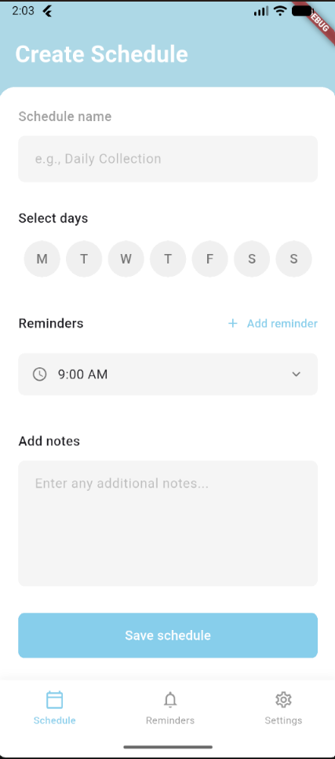
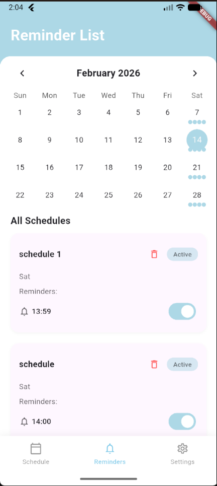
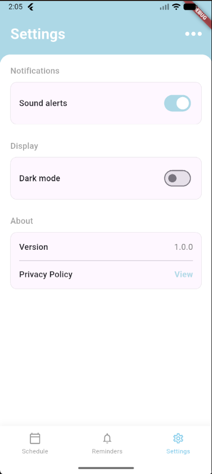

# Water Collection App

A Flutter application designed to help users schedule and manage water collection reminders. It ensures you never miss a collection time by checking your schedule and sending timely local notifications, even when offline.

## Features

- **Schedule Management**: Create, view, and manage weekly water collection schedules.
- **Local Notifications**: Receive reliable reminders with sound and vibration at your scheduled times.
- **Recurring Alarms**: Supports weekly recurring schedules (e.g., every Monday and Wednesday at 9:00 AM) that respect your local timezone.
- **Offline Capable**: 
    - Full functionality without internet access.
    - Uses a local SQLite database for privacy and speed.
    - Smart handling of timezone detection when offline.
- **Battery Efficient**: Uses Android's `AlarmManager` and `WakeLock` to ensure alarms fire even if the device is dozing.
- **Dark Mode**: Supports both light and dark themes for better visibility.

## Tech Stack

- **Framework**: Flutter & Dart
- **Database**: SQLite (`sqflite`)
- **Notifications**: `flutter_local_notifications`
- **Time Management**: `timezone`, `flutter_timezone`

## Installation Steps

1.  **Prerequisites**: Ensure you have [Flutter](https://docs.flutter.dev/get-started/install) installed and set up on your machine.
2.  **Clone the Repository**:
    ```bash
    git clone <repository-url>
    cd water_collection_app
    ```
3.  **Install Dependencies**:
    ```bash
    flutter pub get
    ```

## How to Run the App

1.  **Connect a Device**: Connect an Android device via USB or start an Android Emulator.
2.  **Run the App**:
    ```bash
    flutter run
    ```

## Troubleshooting

### 'INSTALL_FAILED_INSUFFICIENT_STORAGE' on Emulator
If you see this error when running on an Android Emulator:
1.  Open **Device Manager** in Android Studio.
2.  Click the three dots next to your emulator.
3.  Select **Wipe Data**.
4.  Restart the emulator and run `flutter run` again.

### Notifications Not Appearing?
- Ensure **Do Not Disturb** is off.
- Check if the app has **Notification Permissions** enabled in settings.
- Notes for Emulators: Ensure the emulator time is synced with your computer.

## Folder Structure Explanation

The project's source code is located in the `lib` folder and organized as follows:

- **`lib/main.dart`**: The entry point. Initializes services and sets up the app theme and routes.
- **`lib/models/`**: Data models.
    - `schedule_model.dart`: Defines the structure of a schedule item.
- **`lib/screens/`**: UI screens.
    - `splash_screen.dart`: Handles initialization while showing branding.
    - `reminder_list.dart`: Home screen displaying schedules.
    - `schedule_setup.dart`: Form to create/edit schedules.
    - `settings_screen.dart`: App configuration.
- **`lib/services/`**: Business logic.
    - `database_service.dart`: SQLite database operations.
    - `notification_service.dart`: Manages alarms, permissions, and timezone logic.
- **`lib/widgets/`**: Reusable UI components.

## Screenshots

> |  |  |  |

## Permissions

This app requires the following permissions which are requested at runtime:
- **Notifications**: To post alerts.
- **Exact Alarms**: To schedule notifications at precise times.
- **Vibration**: To vibrate the device during an alarm.
- **Wake Lock**: To ensure alarms fire when the screen is off.
